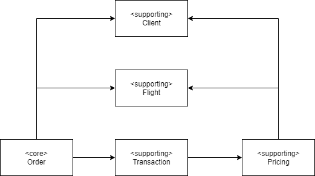

# ddd-airline-tickets

## Overview

A basic system for handling airline ticket ordering.

REST endpoints:
* `GET /client`
* `GET /client/{id}`
* `POST /client (application/json)`
* `GET /flight`
* `POST /flight (application/json)`
* `POST /flight/import (application/json)`
* `GET /order`
* `GET /calculation/id`

## Strategic design



## Build

Prerequisites:
* JDK 12

To compile and run tests (both unit and integration) locally, run:

```
mvn test
```

Due to existence of an integration test checking the flight import functionality, a connection to the Internet is required
when the `mvn test` command is running. 

## Run

To run the application locally, run:

```
mvn spring-boot:run
```

The application will be accessible via `http://locahost:8080`

